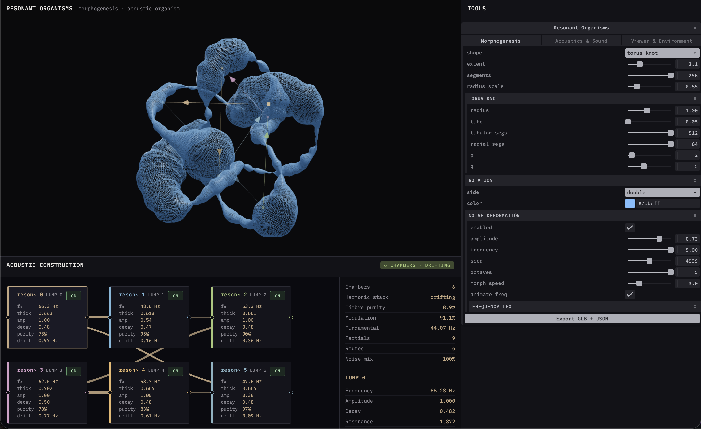

# Resonant Organisms



Playground for **generative organisms**: procedural morphogenesis, material textures, and saveable specimen state (`.organism` files).

Shape families include torus and knots, minimal surfaces (Chen–Gackstätter, López–Ros), Gielis superformula solids, Baschet-inspired leaf resonators, and loaded GLB models. Deform with noise, dress with glass/physical materials and HDR/EXR environments, then keep iterating on a specimen with load / save.

## Acoustic model (torus-first)

Chamber detection and the Pd-style patch (`osc~` / `reson~`) were **designed for deformed tori**: bulges along the ring become resonance chambers linked in a serial chain.

On other shapes the analyzer still runs, but results are unreliable, it basically picks random bulges that are not consistent with the model geometry. Treat acoustics as experimental outside the torus; the morphogenesis side is the broader playground.

## Inspiration

- **[Chavín de Huántar](https://ccrma.stanford.edu/groups/chavin/)**: Andean ceremonial galleries as a coupled network of resonance alcoves linked by narrow ducts; [CCRMA’s waveguide model](https://doi.org/10.1121/1.3508227) of the site’s “resonance rooms connected by sound transmission tubes”
- **[Joaquín Orellana](https://www.youtube.com/@JoaquinOrellanaylaUtileriaSono)**: *útiles sonoros*: sculptural instruments derived from the marimba, built to evoke electronic and imagined timbres
- **[Baschet brothers](https://baschet.org/site/)**:  *structures sonores*: folded-metal sculptures with conical resonators and diffusers, form and timbre inseparable ([Baschet Sound Structures Association](https://baschet.org/site/index.php/the-baschet-story/))
- **[Johan Gielis](https://en.wikipedia.org/wiki/Superformula)** — superformula as a compact generator of natural and abstract forms

## Run

```bash
npm install
npm start
```

Open [http://localhost:9990](http://localhost:9990)

**With audio** — see [supercollider/README.md](supercollider/README.md):

```bash
npm run bridge   # terminal 1
npm start        # terminal 2
```

Evaluate `supercollider/ResonantTorus.scd` in the SuperCollider IDE, then connect via **Tools → Acoustics & Sound → External bridge**.

**Stack**
- [Three.js](https://threejs.org/) — 3D viewer
- [Tweakpane](https://tweakpane.github.io/docs/) — parameter UI
- [SuperCollider](https://supercollider.github.io/) — exciter-driven chamber network (tube resonators + waveguide links)
- [Web MIDI API](https://developer.mozilla.org/en-US/docs/Web/API/Web_MIDI_API) — live pitch and trigger
- File System Access API — `.organism` load / save / overwrite (⌘S)

## License

MIT
